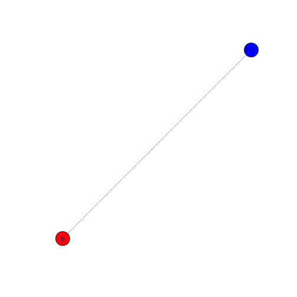
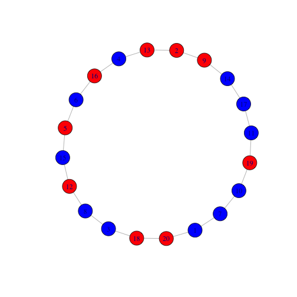
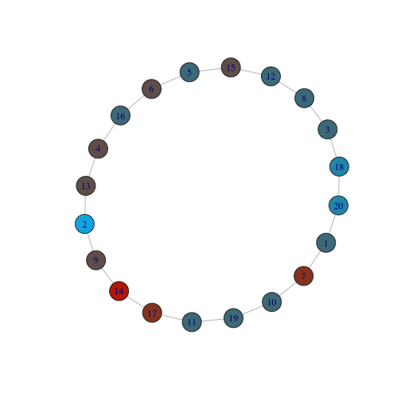
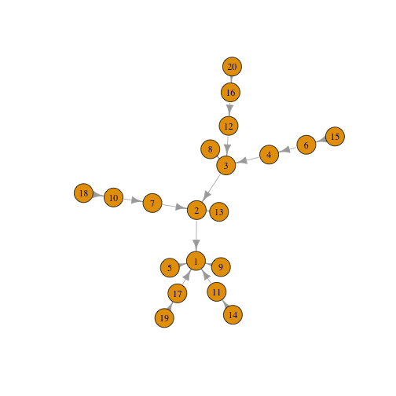

Networked Game Theory
========================================================
author: J. Hamski
date: May 25, 2016
autosize: true


Prisoner's Dilemma
========================================================





Setup Random Graph
========================================================


```r
nodes <- 20
degree <- 2
g.1 <- degree.sequence.game(rep(degree, nodes), method =  "vl")
```


Graph with Strategies
========================================================


Evaluate Network - Find strategy of each opponent
========================================================


```r
network.evaluation <- function(g, nodes){
  network.results <- NULL
  max.degree <- max.degree(g)
  
  for(i in 1:nodes){
    opponents <- neighbors(g, i, mode="all")
    opponent.results <- array(NA, max.degree)
  
    for(j in 1:length(opponents)){
      opponent.results[j] <- opponents[j]$strategy
    }
    network.results <- rbind(network.results, opponent.results)
  }
  return(network.results)
}
```

Evaluate Network - Calculate Game Results
========================================================


```r
game.evaluation <- function(results, nodes, g){
  row.names(results) <- 1:nodes
  results <- cbind(results, V(g)$strategy)
  sentence.list <- NULL
  
  for(i in 1:length(results[,1])){
    if(results[i,1] == 1){ #row defects
        opponent.sum <- sum(results[i,-1])
        if(opponent.sum == 2){sentence.list = c(sentence.list, 0)}
        if(opponent.sum == 3){sentence.list = c(sentence.list, 6)}
        if(opponent.sum == 4){sentence.list = c(sentence.list, 12)}
    }
    else{
        opponent.sum <- sum(results[i,-1])
        if(opponent.sum == 2){sentence.list = c(sentence.list, 1)}
        if(opponent.sum == 3){sentence.list = c(sentence.list, 4)}
        if(opponent.sum == 4){sentence.list = c(sentence.list, 8)}
    }
  }
  return(sentence.list)
}
```

Evaluate Network - Calculate Game Results
========================================================




A More Realistic Network
========================================================

 Barabási–Albert model - a random, scale-free newtwork that commonly arises in human networks:


Next Step (partially done)
========================================================

1) Give all 1st degree nodes a probability of defection.   
2) If a 1st degree node defects, increase the probability of the next node defecting.   
3) Finally, determine the probability of Node 1 - 'The Godfather' - being sentenced.  
